# 📩 IdentityMail

**IdentityMail**, ASP.NET Core MVC ile geliştirilen, kullanıcıların güvenli bir şekilde iletişim kurabildiği ve mesajlarını uçtan uca yönetebildiği modern bir mesajlaşma platformudur.

Kullanıcılar; mesaj gönderme ve yanıtlama, taslak oluşturma, kategorilendirme, önemli mesajları takip etme, arama, filtreleme ve sayfalama gibi özelliklerle kişisel mesaj kutularını yönetebilir. **ASP.NET Core Identity** tabanlı rol yönetimi sayesinde kullanıcı ve admin işlemleri birbirinden ayrılmıştır.

Admin panelinde ise kullanıcı, mesaj ve kategori verileri **LINQ ve Entity Framework Core** sorguları üzerinden analiz edilerek; aktif kullanıcılar, mesaj yoğunluğu, kategori dağılımları ve en fazla mesaj gönderen kullanıcılar gibi istatistikler görüntülenebilmektedir.

---

## 📸 Screenshots

### 🔐 Login

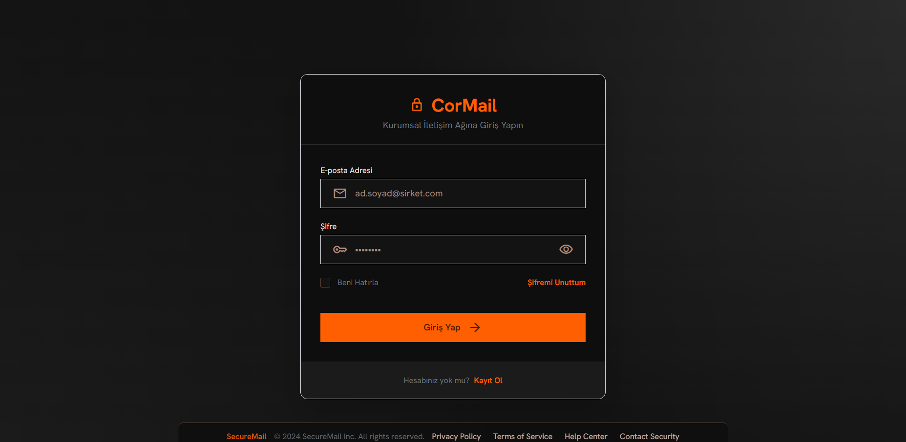

### 📥 Inbox

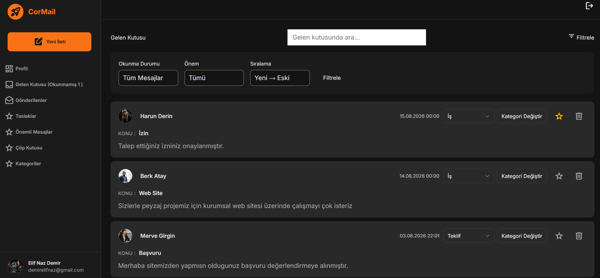

### ✉️ Message Detail

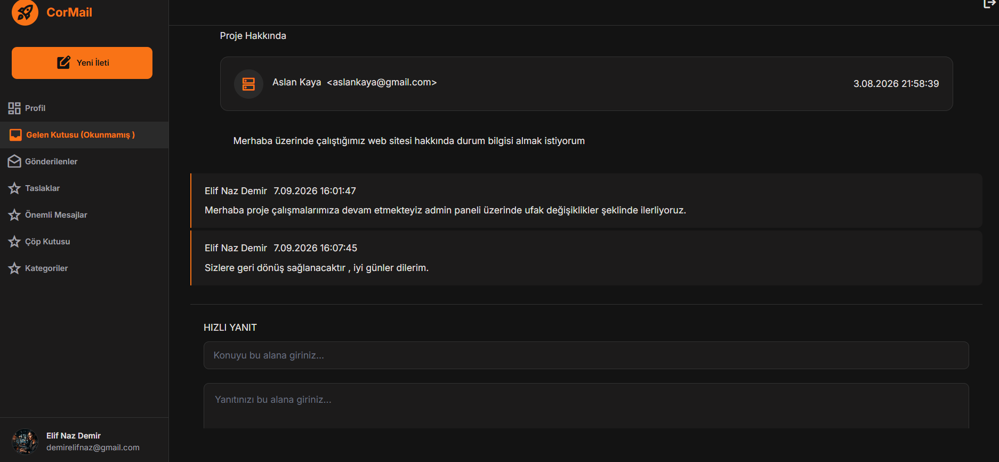

### 📨 New Message

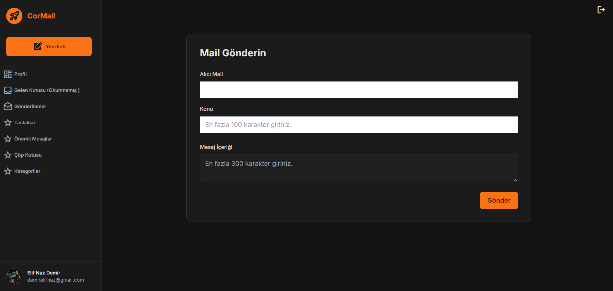

### 📨 Trash

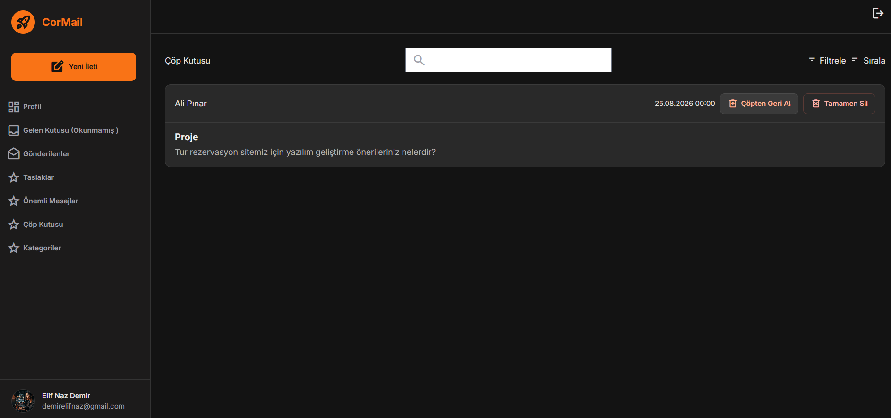

### 👤 Profile

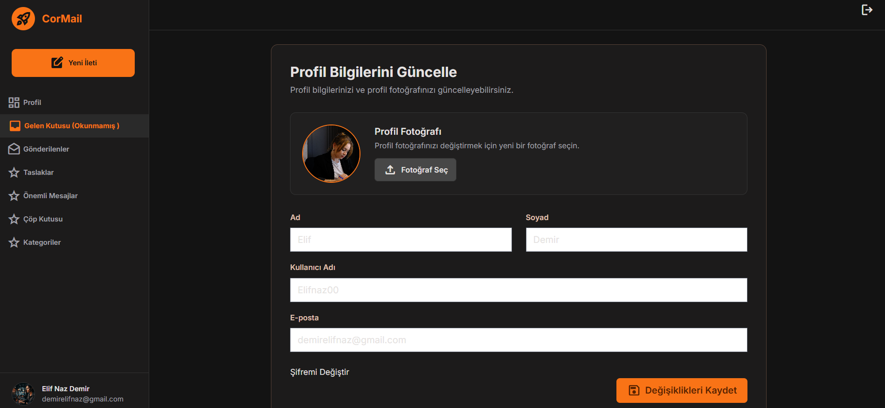

### 👤 Reset Password 

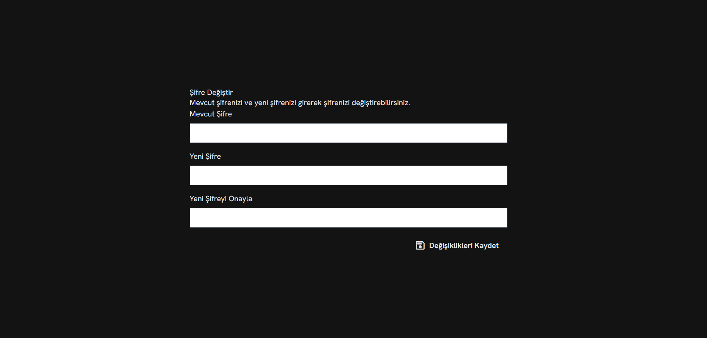

### 👑 Admin Dashboard

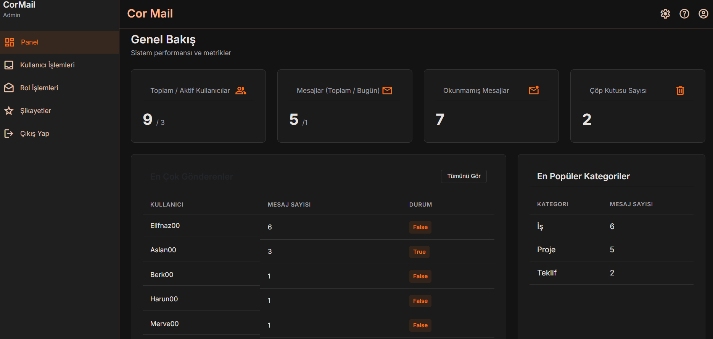

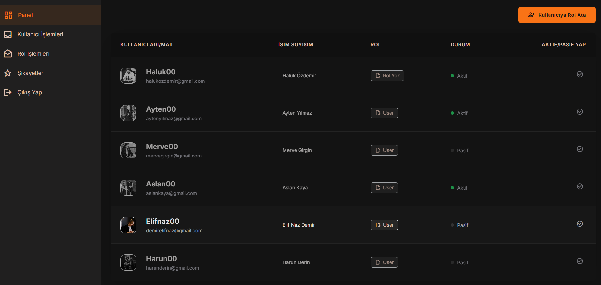

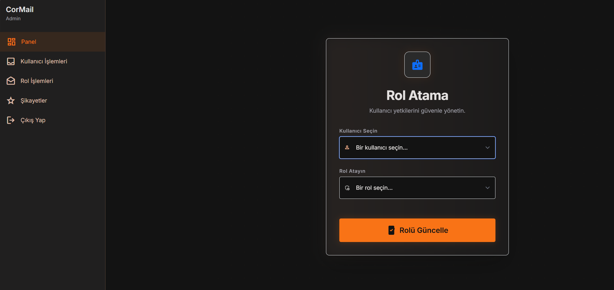

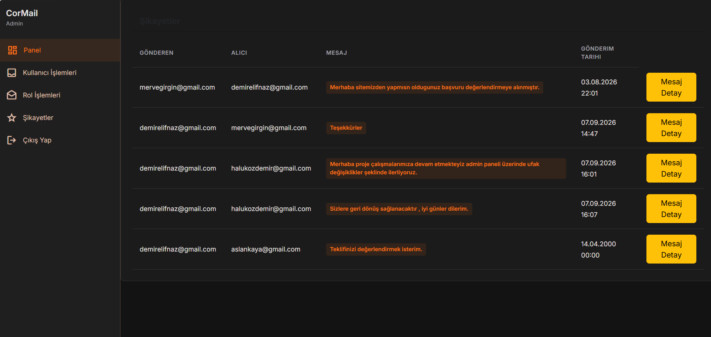

---

## 🚀 Features

### 👤 User

* Register / Login / Logout
* Profil bilgilerini ve profil fotoğrafını güncelleme
* Şifre değiştirme
* Şifremi Unuttum
* Kullanıcılar arası mesaj gönderme
* Mesaj yanıtlama
* Okundu / okunmadı takibi
* Önemli mesajlar
* Taslak mesajlar
* Çöp kutusu ve geri yükleme
* Mesaj kategorileri
* Arama ve filtreleme
* Yeni / eski mesaj sıralaması
* PagedList ile sayfalama
* Okunmamış mesaj sayısı

### 👑 Admin

* Kullanıcıları listeleme
* Kullanıcıları pasif hale getirme
* Rol yönetimi
* Mesaj istatistiklerini görüntüleme
* Kategori bazlı mesaj sayılarını görüntüleme
* Kullanıcıların gönderdiği mesaj sayılarını analiz etme
* En fazla mesaj gönderen kullanıcıları azalan şekilde sıralama

---

## 🛠️ Technologies

* C#
* ASP.NET Core MVC 8
* Entity Framework Core
* Microsoft SQL Server
* ASP.NET Core Identity
* LINQ
* AutoMapper
* FluentValidation
* Data Annotations
* AJAX / Fetch API
* jQuery
* Bootstrap
* SweetAlert2
* PagedList.Core
* Git / GitHub

---

## 🔍 Technical Highlights

### 🔐 Authentication & Authorization

Kullanıcı ve rol yönetimi için **ASP.NET Core Identity** kullanılmıştır.

User ve Admin rollerine göre yetkilendirme ve erişim kontrolü uygulanmıştır.

### 🗄️ Entity Framework Core

Veritabanı işlemleri **EF Core Code First** yaklaşımıyla gerçekleştirilmiştir.

### 🔎 LINQ & Data Analysis

Mesaj listeleme, filtreleme, en çok mesaj gönderen kullanıcı, her kategoride mesaj sayısı gibi dashboard istatistiklerinde LINQ sorgularından yararlanılmıştır.

### ↩️ Message Reply

Mesaj cevapları `ReplyToMessageId` alanı üzerinden ilişkilendirilmiştir.

Bu yapı sayesinde bir mesajın hangi mesaja cevap olduğu takip edilebilmektedir.

### 📄 Pagination & Filtering

Mesaj listelerinde **PagedList.Core** kullanılarak sayfalama uygulanmıştır.

Arama, filtreleme ve sıralama işlemleri LINQ sorgularıyla birlikte çalışacak şekilde geliştirilmiştir.

### ⚡ AJAX / Fetch API

Bazı işlemlerde sayfanın tamamen yenilenmesine gerek kalmadan AJAX / Fetch API kullanılmıştır.

Kullanıcı geri bildirimlerinde **SweetAlert2** kullanılmıştır.

---

## 🗄️ Database Structure

Temel entity yapısı:

```text
AppUser
   │
   ├── SenderId
   ├── ReceiverId
   │
   ▼
UserMessage
   │
   ├── CategoryId
   └── ReplyToMessageId
   │
   ▼
Category
```

`UserMessage` içerisinde mesajın;

* Göndereni
* Alıcısı
* Kategorisi
* Okunma durumu
* Önemli durumu
* Taslak durumu
* Silinme durumu

tutulmaktadır.

---


